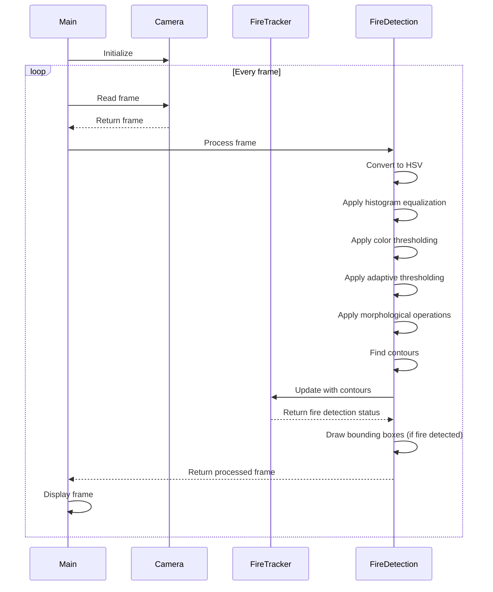

# Fire Detector in Rust Programming Language

## Description

This program is a real-time fire detection system using OpenCV and Rust. It processes video input from a camera to detect and track potential fire sources, with a focus on small, intense flames like those from a lighter.

## Features

- Real-time video processing
- Fire detection using color thresholding and adaptive techniques
- Fire tracking to reduce false positives

## Dependencies

- OpenCV (with Rust bindings)
- Rust standard library

## Sequence Diagram



## Steps of the Fire Detection Process

1. **Video Capture**: The program initialises the camera and sets up a video capture stream.

2. **Frame Processing**: For each captured frame:
   a. Convert the frame from BGR to HSV color space.
   b. Apply histogram equalisation to the V (brightness) channel to improve contrast.
   c. Use color thresholding to isolate potential fire regions.
   d. Apply adaptive thresholding to handle varying lighting conditions.
   e. Use morphological operations (opening and closing) to reduce noise.

3. **Contour Analysis**: Find contours in the processed image.

4. **Fire Tracking**: Update the `FireTracker` with the found contours:
   a. Identify the largest contour.
   b. Calculate its centroid.
   c. Compare the current position with the previous position.
   d. Increment a counter if the fire seems stable (hasn't moved much).

5. **Fire Detection**: If the fire has been stable for several frames:
   a. Analyse each contour for area and aspect ratio.
   b. Check the average intensity of the region.
   c. If criteria are met, mark the region as a potential fire.

6. **Visualisation**: Draw bounding boxes around detected fire regions.

7. **Display**: Show the processed frame with any detected fire regions highlighted.

8. **User Interface**: Allow the user to exit the program by pressing 'q'.

## Usage

1. Ensure all dependencies are installed.
2. Run the program using `cargo run`.
3. Point the camera at the area you want to monitor for fire.
4. The program will display the video feed with any detected fire regions highlighted in red.
5. Press 'q' to exit the program.

## Installation

1. Clone the repository:
   ```bash
   git clone https://github.com/arturogonzalezm/fire_detector_rust.git
   cd fire_detector_rust
   ```

2. Set up the required environment variables (for Linux Ubuntu):
   ```bash
   echo 'export LIBCLANG_PATH=/usr/lib/llvm-18/lib' >> ~/.bashrc
   echo 'export LLVM_CONFIG_PATH=/usr/bin/llvm-config' >> ~/.bashrc
   source ~/.bashrc
   ```

3. Install necessary dependencies:
   ```bash
   sudo apt-get update
   sudo apt-get install llvm-dev libclang-dev
   ```

4. Verify the installation:
   ```bash
   which llvm-config
   find /usr -name libclang.so
   ```

5. Build the project:
   ```bash
   cargo clean
   cargo build
   ```
   
6. Test if it's compiled successfully:
   ```bash
   Compiling libc v0.2.158
   Compiling once_cell v1.19.0
   Compiling num-traits v0.2.19
   Compiling clang-sys v1.8.1
   Compiling jobserver v0.1.32
   Compiling cc v1.1.15
   Compiling clang v2.0.0
   Compiling opencv-binding-generator v0.90.2
   Compiling opencv v0.92.2
   Compiling fire_detector_rust v0.1.0 (/home/path/path/fire_detector_rust)
    Finished `dev` profile [unoptimized + debuginfo] target(s) in 43.46s
    ```
   
7. Run the project:
    ```bash
    cargo run
    ```

## Notes

- The program is optimised for detecting small, intense flames like those from a lighter.
- Adjustments to thresholds and parameters may be necessary for different environments or fire types.
- This system should not be relied upon as a sole means of fire detection in safety-critical applications.